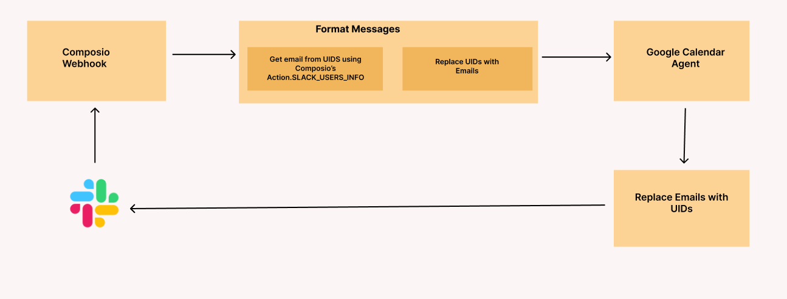

# SlackToCalendar

This Guide shows you how to create an AI powered Slack bot to schedule Google Calendar events.

## workflow overview


## Prerequisites
1. [Composio](https://app.composio.dev/) User Acoount
2. API Key from [Groq](https://console.groq.com/keys)

## Steps to Run

**Navigate to the Project Directory:**
Change to the directory where the `setup.sh`, `main.py`, and `README.md` files are located. For example:
```sh
cd path/to/project/directory
```

### 1. Run the Setup File
Make the setup.sh Script Executable (if necessary):
On Linux or macOS, you might need to make the setup.sh script executable:
```shell
chmod +x setup.sh
```
Execute the setup.sh script to set up the environment and install dependencies:
```shell
./setup.sh
```
Now, fill in the `.env` file with your secrets.

### 2. Run the Python Script
```shell
poetry run python main.py
```

This will setup a webhook that listens to your Slack workspace.
When you send a message tagging the Slack bot, the agent will spring into action and reply with a scheduled event message with the meeting URL.

For a comprehensive walk-through guide, refer to our blog 👇

[](https://blog.composio.dev/building-ai-agents-using-llamaindex/)